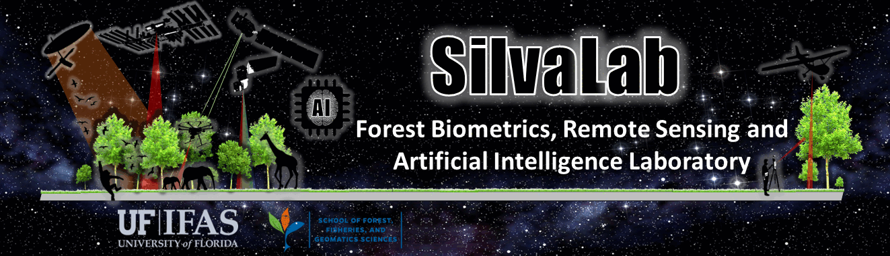
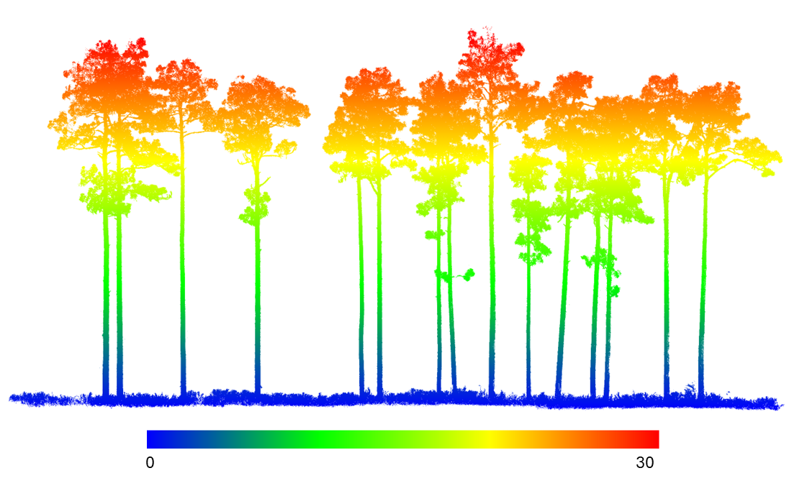
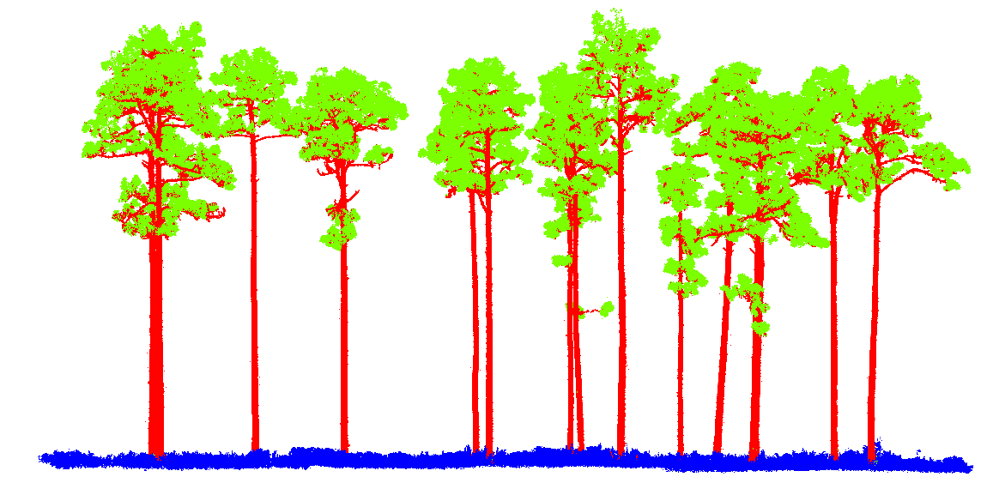

<p align="center">
  
</p>

[](https://venkatasivanaga.r-universe.dev/FuelDeep3D)
[](https://github.com/carlos-alberto-silva/ICESat2VegR/actions/workflows/rhub.yaml)
[](https://cran.r-project.org/package=FuelDeep3D)


# FuelDeep3D: An R package for Fire Fuels Segmentation in 3D Using Terrestrial Laser Scanning and Deep Learning  

**Authors:** Venkata Siva Reddy Naga, Carlos Alberto Silva, et al.,


`FuelDeep3D` provides tools for processing, feature extraction, and classification of 3D forest point clouds for fuel assessment applications. 
The package supports creating training datasets, computing height-derived metrics, segmenting vegetation structures, and writing per-point fuel 
classes back to LAS/LAZ files. These functions streamline TLS-based fuel mapping workflows and enable integration with forest inventory, 
wildfire modeling, and ecological analysis pipelines in R.  

The package enables users to move efficiently from raw .las files to classified fuel layers, supporting applications in forest structure assessment, wildfire behavior modeling, and fuel complexity analysis.

FuelDeep3D offers tools to:

-Build structured training datasets from labeled point clouds
-Compute height-derived features such as height-above-ground (HAG)
-Tile, sample, and preprocess large TLS scenes for efficient modeling
-Apply trained models to new .las files and write predictions back to disk
-Enable users to train their own deep learning models on custom labeled datasets
-Perform visualization, quality control, and evaluation of predicted fuel classes


---

## 1. Getting Started

### 1.1 Installation of the FuelDeep3D package


```r
install.packages(
  "FuelDeep3D",
  repos = c("https://venkatasivanaga.r-universe.dev/FuelDeep3D",
            "https://cloud.r-project.org")
)

library(FuelDeep3D)

```

---

### 1.2 Manual install (official Anaconda)

**i) Download**

- Anaconda (full distribution, includes many packages):  
  <https://www.anaconda.com/download>
- Miniconda (lightweight, only Conda + Python):  
  <https://docs.conda.io/en/latest/miniconda.html>

**ii) Install**

1. Download the Windows installer (**64-bit**) for Python 3.x.
2. Run the installer:
   - Accept the license.
   - Choose **“Just Me”** (recommended) unless you know you need “All Users”.
   - Keep the default install location (e.g. `C:\Users\<you>\anaconda3`).
   - *Optional but convenient:* check **“Add Anaconda to my PATH”** if you want
     to use `conda` from a normal Command Prompt.
3. Click **Next → Install** and wait for the installation to finish.
4. Open **Anaconda Prompt** from the Start menu and run:

   ```bash
   conda --version

### 1.3 Create the `pointnext` Conda environment (from R)

You can create the Python environment directly from R using **reticulate** and
install all Python dependencies from `requirements.txt`.

```r
# 0) Install FuelDeep3D and reticulate if not already
install.packages("FuelDeep3D")    # from r-universe or other repo
install.packages("reticulate")

library(FuelDeep3D)
library(reticulate)

# 1) Create or reuse the "pointnext" env and install deps if needed
ensure_py_env("pointnext")   # creates env + installs deps the first time
# ensure_py_env("pointnext", reinstall = TRUE)  # force reinstall if you want

# 2) Sanity check – should show Python from the "pointnext" env
py_config()

```
---

## 2. Visualization

`FuelDeep3D` integrates smoothly with the **lidR** package, enabling users to quickly explore
raw LiDAR scenes, height structures, and model-predicted segmentations.  
This section provides simple commands to visualize `.las` / `.laz` files during your workflow.

---

### 2.1 Visualize Raw LiDAR by Height (Z)

This visualization shows the raw, unclassified LiDAR point cloud, where points are colored solely based on their height (Z value).
This height-based coloring helps reveal canopy layers, trunk structure, and ground elevation differences.

```r
library(lidR)

las <- readLAS(system.file("extdata", "las", "trees.laz",
                           package = "FuelDeep3D"))

# Visualize by elevation
plot(las, color = "Z", pal = height.colors(30), bg='white')
```

<p align="center">
  
</p>

This view helps inspect canopy structure, terrain variation, and overall point-cloud quality.

---

## 3. Pre-processing

Pre-processing prepares raw TLS point clouds for deep learning–based fuel
segmentation. This step focuses on removing obvious outliers, standardizing
point attributes, and improving the quality of model inputs prior to tiling
and feature extraction.

---

### 3.1 Optional noise filtering

TLS point clouds may contain isolated outlier points, particularly in sparse
regions of the scene. To reduce the influence of these points, FuelDeep3D
provides a utility function based on Statistical Outlier Removal (SOR).

The filtering is applied selectively to points above a user-defined height
threshold, while points below this threshold are preserved. This helps remove
sparse artifacts without affecting ground or lower vegetation structure.

**Parameters:**
- `height_thresh`: height (in meters) above which SOR is applied
- `k`: number of nearest neighbors used to estimate local point spacing
- `zscore`: standard deviation multiplier controlling outlier rejection

#### Example: apply noise filtering

```r
library(FuelDeep3D)
library(lidR)

# Load TLS point cloud
las <- readLAS(system.file("extdata", "las", "trees.laz",
                           package = "FuelDeep3D"))

# Apply SOR-based filtering
las_clean <- remove_noise_sor(
  las,
  height_thresh = 5,
  k = 20,
  zscore = 2.5
)

# Inspect the filtered point cloud
plot(las_clean, color = "Z", pal = height.colors(30), bg = "white")
```

## 4. Train a new model on your own labelled LAS data


```r
library(FuelDeep3D)
library(reticulate)
use_condaenv("pointnext", required = TRUE)

cfg <- config(
  las_path     = system.file("extdata", "las", "trees.laz", package = "FuelDeep3D"),
  out_dir      = system.file("extdata", "npz_files", package = "FuelDeep3D"),
  out_pred_dir = system.file("extdata", "output_directory", package = "FuelDeep3D"),
  model_path   = system.file("extdata", "model", "best_model.pth", package = "FuelDeep3D"),
  epochs       = 2, batch_size = 16,
  learning_rate = 1e-5, weight_decay = 1e-4,
  block_size = 6, stride = 1, sample_n = 4096,
  repeat_per_tile = 4, min_pts_tile = 512,
  cell_size = 0.25, quantile = 0.05
)

res <- train(cfg, setup_env = FALSE)        # trains & saves best .pth
predict(cfg, mode = "overwrite", setup_env = FALSE)  # writes trees_predicted.las
```

---

## 5. Evaluation of Predicted LAS Files

`FuelDeep3D` provides built-in utilities to evaluate model predictions stored inside a LAS/LAZ
file. If your file contains both:

- **Ground truth labels** (e.g., column `"label"`)
- **Predicted classes** (e.g., column `"Classification"`)

you can compute accuracy, confusion matrix, precision, recall, and F1 directly.

---

### 5.1 Evaluate a LAS File

This function allows users to evaluate segmentation performance directly from a single LAS file that contains both ground-truth labels and predicted classes.
Simply specify which attribute stores the true labels (e.g., "label") and which stores the predictions (e.g., "Classification"), and the function computes accuracy, confusion matrix, precision, recall, and F1 scores automatically.

```r
library(FuelDeep3D)
library(lidR)

# Load LAS containing both GT + predictions
las <- readLAS("trees_predicted.las")

# Run evaluation
results <- evaluate_single_las(
  las,
  truth_col = "label",
  pred_col  = "Classification"
)
```

This returns a list with:

- `confusion` – confusion matrix  
- `accuracy` – overall accuracy  
- `precision` – per-class precision  
- `recall` – per-class recall  
- `f1` – per-class F1 scores  

---

### 5.1.1 Visualize Model Predictions (Classification Field)

After running prediction:

```r
predict(cfg, mode = "overwrite")
```

The predicted labels are written into the `Classification` field of the output LAS file.

You can visualize them in R:

```r
las_pred <- readLAS("output_predictions/trees_predicted.las")

# Color by predicted vegetation class
plot(las_pred, color = "Classification")
```

### 5.2 Print Confusion Matrix

```r
print_confusion_matrix(results$confusion)
```

This prints a clean, aligned table such as:

```
| True \ Pred |       0 |       1 |       2 |
|-------------|---------|---------|---------|
|    0        | 528404  |    1005 |    3253 |
|    1        | 25457   | 2598520 | 140186  |
|    2        | 24931   | 449195  | 867824  |

```

---

### 5.3 Print Precision, Recall, F1 and Accuracy in a Table

```r
print_metrics_table(results)
```

This produces an easy-to-read table:

```
| Class   | Precision | Recall | F1_Score | Accuracy |
|---------|-----------|--------|----------|----------|
| 0       | 0.9508    | 0.9535 | 0.9521   | 0.9535   |
| 1       | 0.8940    | 0.9450 | 0.9188   | 0.9450   |
| 2       | 0.7375    | 0.6552 | 0.6941   | 0.7552   | 
| Overall | 0.8608    | 0.8512 | 0.8550   | 0.9012   |
|---------|-----------|--------|----------|----------|

```

Where the **Overall** row reports macro-averaged precision, recall, and F1 across all classes.

---

### 5.4 Class Distribution Summary

```r
class_summary(las)
```

Shows how many points belong to each predicted class.

---

These tools make it simple to evaluate segmentation performance directly from a LAS file without requiring external scripts or reformatting.

---

### 5.5 Predicted Result

The figure below shows an example of the vegetation segmentation applied to a labeled LAS file.
Each point is colored by its predicted class (e.g., ground/understory, stem, canopy foliage).



<p align="center">
  
</p>


In this example, the model was trained on `trees.las` and then used to predict labels for the
same scene. The output LAS (`trees_predicted.las`) stores predictions in the `classification`
field, which can be visualized in tools like CloudCompare or QGIS using a class-based color ramp.

---

# Acknowledgements

We gratefully acknowledge ------------

# Reporting Issues

Please report any issue regarding the FuelDeep3D package to Venkata Siva Reddy Naga (<vs.naga@ufl.edu>)  or Dr. Silva
(<c.silva@ufl.edu>).

# Citing FuelDeep3D

Venkata Siva Naga; Silva,C.A. FuelDeep3D: An R R wrapper around a PyTorch point-cloud model for tree / vegetation segmentation from LiDAR .las files.version 0.0.1, accessed on Dec. 13 2025,
available at: <https://CRAN.R-project.org/package=FuelDeep3D>

# Disclaimer

**FuelDeep3D package comes with no guarantee, expressed or implied, and
the authors hold no responsibility for its use or reliability of its
outputs.**
